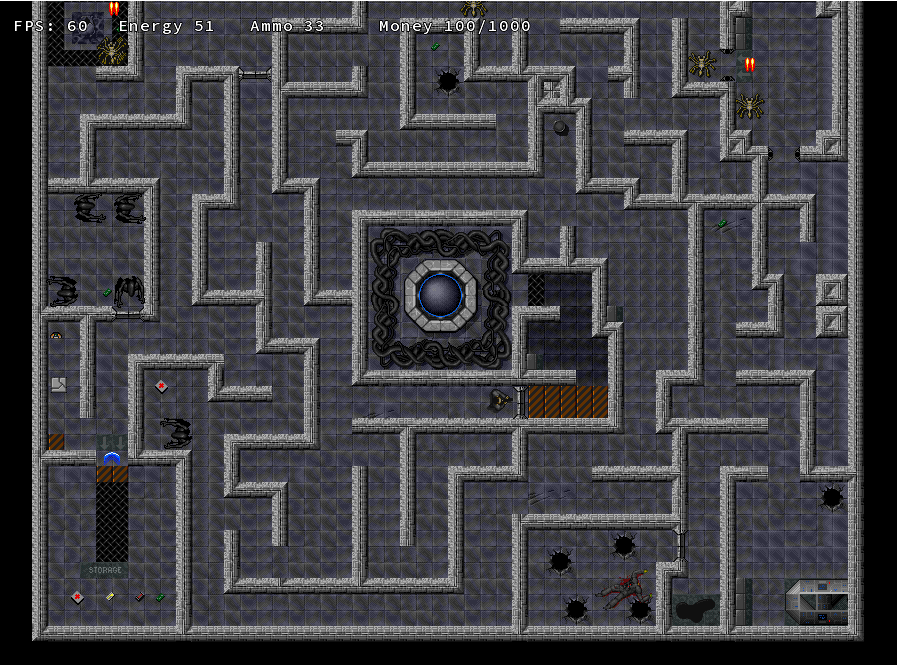

# Project-Ellen Game

## Overview
**Ellen Game** is a 2D alien-fighting game developed in Java using object-oriented programming principles. Players control Ellen as she battles waves of invading aliens.

## Features
- Object-oriented design for characters and enemies
- Smooth 2D graphics and animations
- Increasing difficulty with each level

## How to Play
Move with arrow keys, shoot with spacebar, and defeat all aliens to progress!

